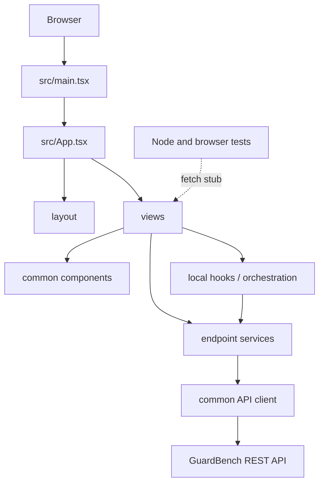
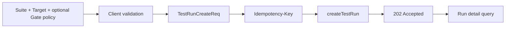
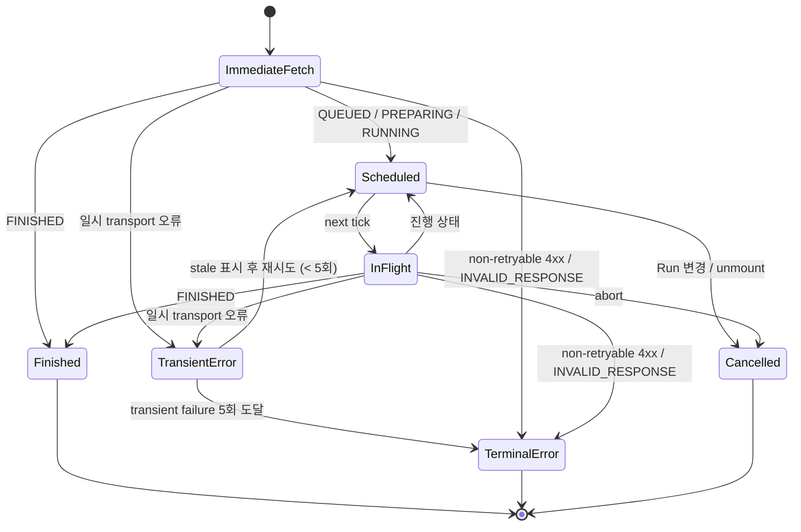

# 프론트엔드 아키텍처

> Status: APPROVED
> Owner: Frontend
> Last reviewed: 2026-09-26
> Canonical source: GitHub repository (`src/`)
> Scope: GitHub Issues #34, #62, #86, #111, #113
> #86 갱신: 단일 Target 생성 계약과 결과·회귀 화면의 평가 정책 metadata 제거를 반영한다.
> Canonical API: [`../api/openapi.yaml`](../api/openapi.yaml) (`APPROVED`)
> Product flows: [`../product/screen-spec.md`](../product/screen-spec.md), [`../product/user-flows.md`](../product/user-flows.md)
> API consumption contract: [`../contracts/api-integration.md`](../contracts/api-integration.md)

이 문서는 현재 source에서 확인한 프론트엔드 구조와 책임 경계를 승인 기준으로 기록한다. 미래 구조 변경 제안은 `DRAFT`로 표시하며 현재 구조로 취급하지 않는다. 특정 library 도입이나 대규모 폴더 이동을 승인하지 않으며, API schema와 Backend의 evaluation·comparability 규칙을 Frontend에서 다시 정의하지 않는다.

API 요청·응답의 의미와 우선순위는 OpenAPI를 최우선으로 하고, 프론트엔드 소비 규칙은 [API 연동 계약](../contracts/api-integration.md)을 따른다. 이 문서는 해당 계약을 구현하기 위한 상태 소유권, 의존 방향과 계층 경계만 소유한다.

## 1. 구조 개요



Views와 data-aware modal은 API service를 직접 호출할 수 있고 polling/comparison처럼 여러 화면이 공유하는 orchestration은 hook을 사용한다. `apiClient`가 envelope와 transport 경계를 처리한다. OpenAPI에 없는 값을 화면용 code로 실제 서버 값처럼 보충하지 않는다.

## 2. 현재 구조 (`Current behavior`)

- `main.tsx`가 React `StrictMode` 아래 `App`을 렌더링한다.
- `App`이 shell, 현재 view, 선택 Run ID, mobile menu와 toast를 소유한다.
- 별도 routing library, 전역 server-state 계층과 전역 React error boundary는 없다.
- `views`와 data-aware modal이 API 호출, loading/error, DTO 변환과 사용자 표현을 함께 담당한다.
- `services`가 endpoint 함수와 수동 DTO를 소유하고 `apiClient`가 base URL, fetch와 envelope unwrap을 담당한다.
- `useLiveRunProgress`가 Run 상세 Polling, abort, transient/terminal 오류와 자동 재시도 상한을 처리한다.
- Suite/TestCase, Run 생성·목록·상세·결과·metrics 화면은 API의 data/empty/error/stale 상태를 구분한다.
- 최종 사용자 화면 전용 mock data는 두지 않으며 API 화면은 실패를 mock 성공으로 대체하지 않는다.

현재 코드는 최신 OpenAPI의 필수 model을 포함한 단일 Application Target, Evaluator 결과와 Quality Gate evidence를 사용한다. Regression 후보와 비교 UI도 `RegressionSummaryEntry`, `RegressionDetailView`, `useRegressionComparison`에서 구현되어 있다.

## 3. 실행과 환경 경계

### 현재 (`Current behavior`)

- Vite가 dev/build/preview를 담당하고 `tsc -b`가 build 전 TypeScript를 검사한다.
- `runtimeConfig`는 `VITE_DATA_MODE`와 `VITE_API_BASE_URL`을 읽는다.
- data mode 기본값은 `api`, base URL 기본값은 `/api/v1`이다.
- Vite proxy 설정이 없어 상대 base URL의 실제 연결은 배포 환경에 의존한다.

### 현재 browser configuration rules

- 브라우저 환경 변수에는 secret, provider credential과 내부 Evaluator 설정을 포함하지 않는다.
- `demo` mode는 현재 banner만 바꾸며 API data source를 대체하지 않는다.
- 개별 결과 목록은 Application Response를 포함하지 않는다. Snapshot 상세에서 사용하는 별도 detail API와 UI 상태는 아래 결과 경계를 따른다.
- build-time 설정, 배포별 주입과 runtime 변경이 필요한 설정의 경계를 문서화한다.

fixture-backed demo adapter와 fail-fast 설정 처리는 구현되어 있지 않다.

## 4. Navigation과 화면 identity

### 현재 (`Current behavior`)

- `src/routing/routes.ts`가 pathname을 dashboard, suites, new-run, runs, result, regression 또는 invalid-run으로 해석한다.
- `App`이 History API navigation과 `popstate`를 처리하고 선택 Run ID를 route에서 복원한다.
- `/runs/{runId}`와 `/runs/{runId}/regression`은 직접 접근할 수 있으며 잘못된 Run ID는 invalid-run 화면을 표시한다.
- 목록 filter와 page 상태는 URL query에 보존하지 않는다.

### 목표 책임 (`DRAFT`)

- filter/page query를 URL에 보존한다.
- form draft를 화면 이동 뒤 복원한다.

별도 routing library 도입은 현재 구현되지 않았다.

## 5. 상태 소유권

서버 상태, 파생 표시 상태와 local interaction state를 구분한다.

| 상태 | 서버 source of truth | 현재 요청·상태 owner | 분리된 local state |
| --- | --- | --- | --- |
| Suite 목록 | `GET /test-suites` | `SuitesView` | 선택 card, 생성 modal |
| Suite 내 TestCase 목록 | `GET /test-suites/{id}/test-cases` | `useSuiteTestCases` | 현재 page와 collection 갱신 상태 |
| TestCase mutation | TestCase service | `SuiteDetailModal` | create/edit draft와 선택 row |
| Run 목록 | `GET /test-runs` | `RunsView` | 검색·상태 filter |
| Run 상세와 polling | `GET /test-runs/{id}` | `ResultDetailView` + `useLiveRunProgress` | result selection, filters, tabs |
| Run 결과 목록 | `GET /test-runs/{id}/results` | `ResultDetailView` | page/filter/sort 상태; list DTO에 Application Response 없음 |
| Run 결과 상세 | `GET /test-runs/{id}/results/{snapshotId}` | `ApplicationResponseEvidence` | dialog open 시 조회한 `TestRunResultDetailRes` |
| Evaluator metrics | `GET /test-runs/{id}/evaluator-metrics` | `ResultDetailView` | presentation 상태 |
| Comparable Runs와 comparison | comparison endpoints | `App` + `useRegressionComparison` | 선택 comparison Run 및 화면 state |

### 5.1 Query identity

query identity는 endpoint 결과를 유일하게 결정하는 입력을 포함한다.

- collection은 resource ID, page, size, sort와 server filter를 포함한다.
- Run 상세·metrics는 Run ID를 포함한다.
- comparison은 current Run ID와 comparison Run ID를 모두 포함한다.
- 서로 다른 filter/page 결과를 같은 state에 합쳐 전체 collection처럼 취급하지 않는다.

이 저장소에는 전역 query/cache library가 없다. 각 view 또는 hook이 필요한 resource identity와 갱신 상태를 local React state로 관리한다.

### 5.2 Nullable와 파생 상태

- required + nullable field의 누락은 계약 불일치이고 명시적 `null`은 허용된 상태다.
- `qualityGate: null`과 `qualityGate.status: NOT_EVALUATED`를 분리한다.
- verdict가 없는 결과의 assertion/outcome을 FAIL이나 FP/FN으로 추정하지 않는다.
- Result page 일부로 전체 Evaluator metrics나 Quality Gate를 다시 계산하지 않는다.
- 화면용 label, percentage formatting과 badge는 원본 DTO를 바꾸지 않는 파생 상태다.

## 6. API 계층과 mapper

### 계층별 책임

| 계층 | 책임 |
| --- | --- |
| common client | base URL, 공통 header, fetch, success envelope, `204`, transport/HTTP/API 오류 |
| endpoint service | method, path/query/header/body와 API DTO |
| mapping rule | 화면에서 DTO를 표현할 때 nullable/결과 분류를 보존한다. 전역 mapper layer는 없다. |
| hook/application | query·mutation lifecycle, Polling, request identity, 취소와 동기화 |
| view | 사용자 action과 loading/empty/error/stale/success 표현 |

### DTO 원칙

- OpenAPI schema와 enum을 source of truth로 사용한다.
- API DTO와 화면 model을 분리한다.
- 단일 Target을 legacy `baseline/candidate` 구조로 변환하지 않는다.
- 응답에 없는 평가 정책 metadata를 화면 호환용으로 합성하지 않는다.
- 결과 목록 DTO `TestRunResultListItemRes`에는 Application Response가 없다. 상세 DTO `TestRunResultDetailRes`는 OpenAPI의 required nullable `applicationResponse`를 포함한다.
- Application Response와 provider 원문, stack trace, 내부 예외 메시지를 같은 필드나 의미로 취급하지 않는다.
- comparison summary와 case별 change/classification은 서버 DTO를 보존하고 프론트에서 재분류하지 않는다.
- unknown public error code도 stage/message와 함께 보존한다.

현재 DTO는 수동 TypeScript type이며 `src/contracts/openapiNullability.contract.ts`가 대표 nullable 조합을 compile-time에서 확인한다. OpenAPI type generation과 runtime schema validation은 도입하지 않았다.

## 7. TestRun 생성 mutation



- form draft와 server mutation 상태를 분리한다.
- request DTO는 `testSuiteId`, URL/model/선택 revision을 가진 단일 `target`, 선택적인 `qualityGatePolicy`를 지원한다. 화면은 두 threshold를 0~100%로 입력받아 함께 0~1로 변환하며, 둘 다 비우면 정책을 생략해 backend 기본값을 사용한다.
- 같은 논리적 재전송은 같은 key와 body를 사용하고 다른 body에 key를 재사용하지 않는다.
- `202`를 실행 완료로 처리하지 않는다.
- 현재는 response의 Run ID로 Result Detail identity를 이동한다. `apiClient`가 `Location` header를 노출하지 않으므로 header 보존은 남은 계약 격차다.
- `TEST_SUITE_EMPTY`는 활성 TestCase 준비 흐름으로 연결한다.
- `IDEMPOTENCY_KEY_CONFLICT`는 같은 key를 다른 body에 사용한 충돌이므로 자동 재전송을 중단한다.
- network/timeout은 접수 여부가 불명일 수 있으므로 명시적 validation/API 거부와 구분한다.

현재 화면은 Quality Gate 정책을 포함한 payload fingerprint별 key를 보존하고 network 결과 불명에서는 재사용하며 성공 또는 명시적
서버 거부 후 폐기한다. 화면 이탈 후 key 복원과 장기 보존은 구현되어 있지 않다.

## 8. Polling 구조

Polling은 Run 상세 query의 lifecycle 조율이며 별도 Run 상태를 만들어내지 않는다.



- Run ID가 바뀌면 timer와 in-flight request를 취소한다.
- 요청이 겹치지 않도록 다음 fetch 예약과 현재 request 완료를 조율한다.
- 늦게 도착한 이전 Run 응답은 폐기한다.
- FINISHED에서 중단하고 results와 metrics query를 활성화한다.
- 일시 오류 후 이전 detail을 유지하면 stale로 표시한다.
- `INVALID_RESPONSE`와 HTTP 4xx 중 408, 429를 제외한 오류는 retry하지 않는 terminal 분류다. `TEST_RUN_NOT_FOUND`는 그 예시다. 그 밖의 transient 오류도 연속 5회가 되면 polling을 중단한다.
- results, evaluator-metrics 또는 비교 조회에서 `TEST_RUN_NOT_FINISHED`가 발생하면 terminal 오류나 empty로 확정하지 않고 Run detail을 다시 확인한다.

기본 간격은 3초, document가 hidden이면 최소 10초다. `INVALID_RESPONSE`와 408/429를 제외한 4xx는 retry하지 않는다. 그 밖의 transient failure는 연속 5회 발생하면 자동 갱신을 중단한다. 최대 전체 대기 시간은 없다.

## 9. 결과와 Evaluator 분석 경계

Run이 FINISHED이면 detail과 별도로 results 및 evaluator-metrics를 조회한다.

```text
RunDetail
├─ lifecycle / progress / outcome / Quality Gate
├─ target
├─ ResultCollection(page + filters)
└─ EvaluatorMetrics(TP/TN/FP/FN + rates)
```

- detail, result collection과 metrics의 loading/error/stale 상태를 각각 보존한다.
- results가 실패해도 이미 성공한 detail을 지우지 않는다.
- metrics 실패를 Quality Gate 실패나 Run ERROR로 바꾸지 않는다.
- result filter는 저장 결과 목록만 좁히며 metrics를 바꾸지 않는다.
- `evaluationOutcome`의 TP/TN/FP/FN 분류는 서버 결과를 보존하며 verdict가 없으면 추정하지 않는다.
- `APPLICATION_TARGET` 또는 `EVALUATOR` failure stage는 assertion과 다른 축으로 표시한다.
- 결과 목록은 `TestRunResultListItemRes`를 사용하고 Application Response를 포함하지 않는다. Snapshot 상세 dialog가 열리면 `ApplicationResponseEvidence`가 결과 상세 API를 별도로 호출하고 `applicationResponse`를 component state에 보관한다. 값이 있을 때 기본은 접힌 상태이며 사용자가 reveal action을 선택하면 dialog 안에 표시한다.
- Application Response 외의 provider 원문, stack trace와 내부 예외 메시지는 별개 데이터이며 공개 결과로 추측하거나 보충하지 않는다.
- results 또는 evaluator-metrics가 `TEST_RUN_NOT_FINISHED`를 반환하면 detail 상태를 다시 조회하고 진행 흐름으로 복귀한다.

Quality Gate의 `assertion`과 `execution` evidence는 detail DTO에서 보존하고 `value`와 `threshold`만
표시 단계에서 퍼센트로 변환한다. Gate status와 metric별 `passed`를 result page에서 재계산하지 않는다.
실패 설명도 수치 비교가 아니라 backend의 `passed: false`를 기준으로 선택한다.

## 10. Comparable Runs와 comparison 경계

Regression은 현재 Run 자체의 Quality Gate와 독립적인 조회 기능이다.

1. current Run ID로 comparable-runs를 조회한다.
2. backend가 반환한 비교 후보만 선택 가능하게 한다.
3. current/comparison Run ID 조합으로 comparison을 조회한다.
4. Run을 바꾸면 후보, 선택과 comparison state를 함께 무효화한다.
5. 비교 API는 저장 결과만 사용하며 Application/Evaluator를 재호출하지 않는다.
6. `TEST_RUN_NOT_FINISHED`이면 관련 Run detail을 다시 확인한다.
7. `TEST_RUNS_NOT_COMPARABLE`이면 comparison state를 비우고 comparable-runs를 재조회하거나 다른 후보를 선택하게 한다.

`App`이 current Run별 `useRegressionComparison` 상태를 소유한다. Result Detail은 case-level `items`가 없는
comparison summary endpoint를 사용하고, Regression Detail에 진입할 때만 전체 comparison을 조회한다.
Result Detail의 Run 상태 polling이 `FINISHED` 전환을 확인하면, `TEST_RUN_NOT_FINISHED`로 대기 중이던
Regression 후보 조회를 다시 시작한다. 고정 재시도 횟수를 실행 시간의 완료 조건으로 사용하지 않는다.
두 화면은 후보와 선택 baseline을 공유하고, 이미 불러온 전체 comparison은 왕복 화면 전환에서 재사용한다.
화면 전환이나 재시도로 선택 baseline을 초기화하지 않고 current Run이 바뀌면 render commit 전에 전체
Regression state를 무효화한다. Summary와 Detail consumer에는 각 화면이 필요한 좁은 state 계약만 전달한다.

comparability 규칙을 프론트에서 복제하거나 같은 Suite라는 이유로 후보를 추가하지 않는다. comparison
응답의 summary count, 이전·현재 verdict, comparability status와 change type은 서버 값을 보존한다.
`NOT_COMPARABLE` item의 nullable verdict/change type 표현은 backend #144에서 OpenAPI 3.0.3 도구
호환성을 명확히 한 뒤 generated type 도입 시 재확인한다.

## 11. Mutation 동기화

| mutation | 성공 후 동기화 | 실패 원칙 |
| --- | --- | --- |
| Suite 생성 | 목록에 server response 반영 또는 관련 query 재조회 | validation을 form에 유지 |
| Suite 수정 | 상세·목록의 관련 data 동기화 | 원래 server data를 성공으로 덮지 않음 |
| TestCase 생성 | 현재 Suite의 collection/page 재동기화 | 임시 item을 실제 ID처럼 유지하지 않음 |
| TestCase 수정 | 상세·목록의 동일 ID 갱신 | 과거 Snapshot 결과를 수정하지 않음 |
| TestCase 삭제 | `204` 후 제거 또는 재조회 | 실패 시 성공 제거를 확정하지 않음 |
| Run 생성 | 반환 Run ID의 detail query로 이동 | 접수 결과 불명과 명시적 거부 구분 |

낙관적 update, invalidate/refetch와 rollback 방식은 endpoint별로 결정한다. 어떤 방식이든 server response 이전에 성공을 확정하지 않는다.

## 12. 오류와 복구 경계

| 경계 | 책임 |
| --- | --- |
| common client | network, abort, invalid response, HTTP/envelope 오류 구조화 |
| endpoint service | endpoint context와 공개 code/field error 보존 |
| mapper | 계약에 맞지 않는 shape를 정상 empty로 바꾸지 않음 |
| hook/application | retry, stale, race, mutation 결과 불명 조율 |
| view | 지속 오류, field error, empty와 재시도 표현 |
| React error boundary | 예상하지 못한 render 오류 격리 |

- request abort를 실패 toast로 표시하지 않는다.
- stale data에는 갱신 실패 상태를 함께 표시한다.
- execution result의 `error.stage`와 HTTP request error를 같은 오류로 처리하지 않는다.
- server가 공개하지 않은 provider 원문과 내부 예외를 노출하지 않는다.
- unknown code는 버리지 않고 안전한 일반 표현과 진단 context를 유지한다.

현재 global error boundary와 공통 logging/observability 계층은 없다. 인증 오류 UX도 구현하지 않았다.

## 13. Demo, mock과 fixture

- `runtimeConfig`는 `VITE_DATA_MODE`를 읽고 기본값을 `api`로 둔다. 현재 `demo` 선택은 App에 DEMO banner를 표시하지만 별도 demo adapter나 fixture data source를 선택하지 않는다.
- API 화면은 여전히 API service를 호출하며 API 실패·empty를 mock 성공으로 대체하지 않는다.
- Browser test의 API fixtures는 `tests/browser/support/apiStub.ts`에서 관리하고 실제 Backend contract를 대신하지 않는다.

별도 demo data adapter와 실제 사용자용 fixture 화면은 구현되어 있지 않다. demo mode가 data source를 전환해야 한다면 별도 Issue에서 동작과 운영 경계를 승인해야 한다.

## 14. Component 책임

### 현재 (`Current behavior`)

- `App`: shell, route 전환, 선택 Run, Regression orchestration과 toast
- `layout`: sidebar/topbar와 mobile navigation
- `views`: 화면 composition + request + mapping + 상태 표현
- `common`: 표시 component와 data-aware modal 혼재
- `hooks`: Run progress polling과 Regression 조회 orchestration

### 목표 (`DRAFT`)

- view는 화면 composition과 사용자 상태 표현을 소유한다.
- form은 draft/validation/submission을 소유하되 HTTP envelope를 해석하지 않는다.
- common 표시 component는 endpoint, DTO와 mock을 직접 import하지 않는다.
- data-aware modal은 query/mutation identity와 외부 갱신 계약을 명시한다.
- Status component는 lifecycle, outcome, Quality Gate, assertion과 execution status의 의미를 합치지 않는다.
- `QualityGateEvidence`는 status별 제목·tone과 서버가 확정한 metric evidence·실패 이유의 표현을 소유하고, Result Detail은 결과 집계와 상태별 안내 문구를 제공한다.
- Snapshot 상세는 목록 DTO의 항목에 더해 전용 detail API의 `applicationResponse`를 on-demand로 조회한다. 값은 기본적으로 숨기고 사용자가 reveal action을 선택한 경우에 표시한다.

prop drilling, context와 전역 store 선택은 실제 공유 범위를 확인한 뒤 결정한다.

## 15. 폴더와 의존 규칙

### 현재 구조

```text
src/
├─ components/
│  ├─ layout/
│  ├─ views/
│  └─ common/
├─ config/
├─ contracts/
├─ hooks/
├─ services/
├─ routing/
├─ types/
├─ utils/
├─ App.tsx
└─ main.tsx
```

### 계층 규칙

- common client와 services는 React component를 import하지 않는다.
- common display component는 특정 view/service를 import하지 않는다.
- API DTO와 UI model의 소유 위치를 구분한다.
- transport 계층이 UI 계층을 참조하지 않는다.
- production service가 mock을 implicit fallback으로 import하지 않는다.
- 순환 import를 허용하지 않는다.
- 폴더 이동은 구현 이슈에서 검증 가능한 단위로 수행한다.

feature-based 폴더, query library와 generated API package 도입은 이 문서에서 확정하지 않는다.

## 16. 테스트 전략

### 현재 (`Current behavior`)

- `npm test`는 Node test runner 기반 순수 로직·계약 테스트를 실행한다.
- `npm run test:component`는 Vitest Browser Mode와 Playwright provider로 React 컴포넌트를 실제 Chromium에 렌더링한다.
- browser component test는 role·label 기반 상호작용, focus, portal과 실제 CSS layout을 검증하며 공통 fetch stub으로 API를 결정적으로 대체한다.
- `deploy.yml`은 `dev` 또는 `main` 대상 PR에서 lint, Node test, build와 별도 Chromium component-test job을 실행한다. `main` push에서는 같은 검증을 거친 뒤 build artifact를 dev에 배포한다. `component-release.yml`은 수동 release workflow다.
- `src/contracts/openapiNullability.contract.ts`는 `tsc -b`에서 OpenAPI의 대표 required + nullable DTO 조합을 compile-time contract로 검증한다.
- 실제 backend를 포함하는 자동화 E2E와 OpenAPI fixture 기반 contract test는 아직 없다.

### 검증 경계

| 수준 | 주요 검증 |
| --- | --- |
| Unit | DTO mapper, nullable 상태, query serialization, error mapping |
| Component | form validation, loading/empty/error/stale, status 구분 |
| Integration | service 연결, mutation 동기화, Polling 취소·race |
| Contract | OpenAPI fixture drift, required/nullable/additionalProperties |
| E2E | Suite 준비 → Run 접수 → Polling → 결과·metrics 검토 |

반드시 포함할 대표 계약 조합은 다음과 같다.

- 생성 payload에 Suite와 단일 Target만 포함하며 판정 설정을 추가하지 않음
- `qualityGate: null`과 `NOT_EVALUATED + metrics: null`
- execution failure와 assertion FAIL 분리
- verdict/assertion/outcome nullable 조합
- result filter empty와 전체 empty 구분
- current Run 변경 시 metrics/comparison state 격리
- 결과 목록 DTO에 Application Response가 없고, 상세 DTO의 nullable Application Response가 on-demand detail UI와 일치함

테스트 작성·mock·실행 규칙은 [`../testing.md`](../testing.md)를 따른다. 실제 Backend E2E test와 별도 환경은 구현되어 있지 않다.

## 17. 기록된 결정

승인된 현재 결정은 [ADR index](../decisions/README.md)에 둔다. 새 router, query/cache library, generated API types, demo data adapter, global error boundary, observability, 또는 Backend E2E 환경은 현재 구현이나 승인 결정으로 간주하지 않는다. 제안이 필요하면 별도 Issue/ADR에서 근거와 범위를 먼저 승인한다.

## 18. 검증 근거

- [`../api/openapi.yaml`](../api/openapi.yaml)
- [`../contracts/api-integration.md`](../contracts/api-integration.md)
- [`../product/screen-spec.md`](../product/screen-spec.md)
- [`../product/user-flows.md`](../product/user-flows.md)
- `src/main.tsx`, `src/App.tsx`
- `src/components/layout`, `src/components/views`, `src/components/common`
- `src/config`, `src/routing`, `src/services`, `src/hooks`, `src/types`, `src/contracts`, `src/utils`
- `package.json`, `vite.config.ts`, `tsconfig.app.json`
- GitHub Issues #27, #28, #29, #30, #34

실제 코드 재구성, library 도입, backend E2E와 OpenAPI 변경은 이 Issue 범위에 포함하지 않는다.
