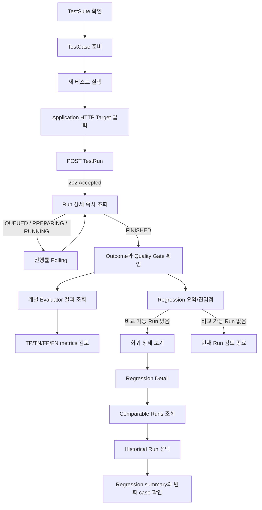
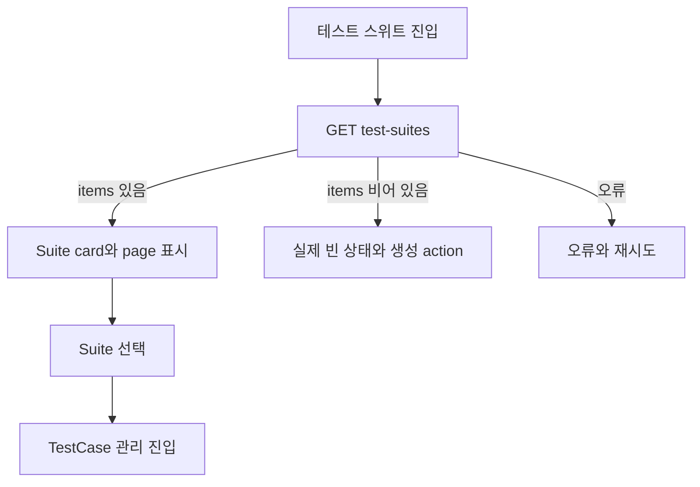
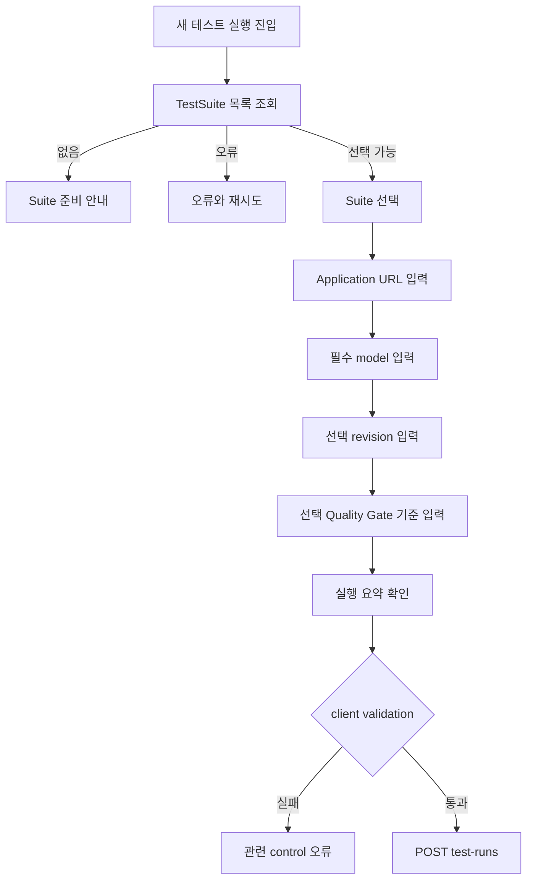
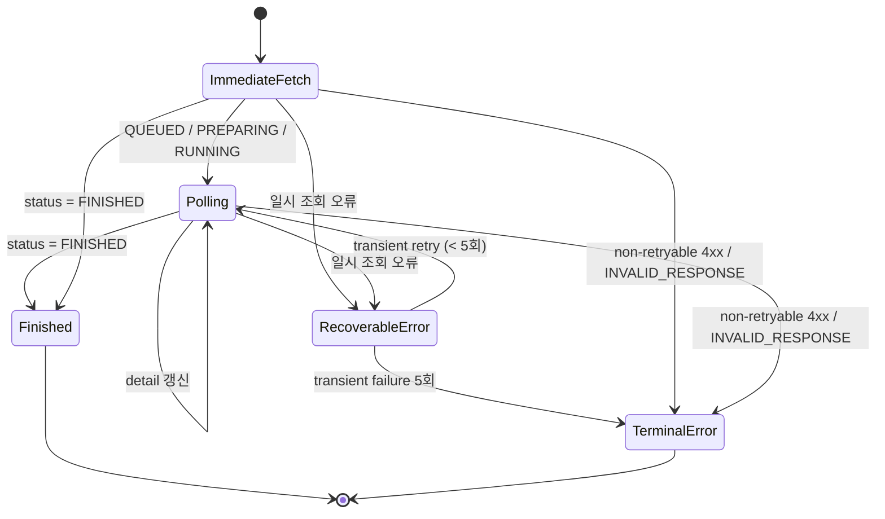
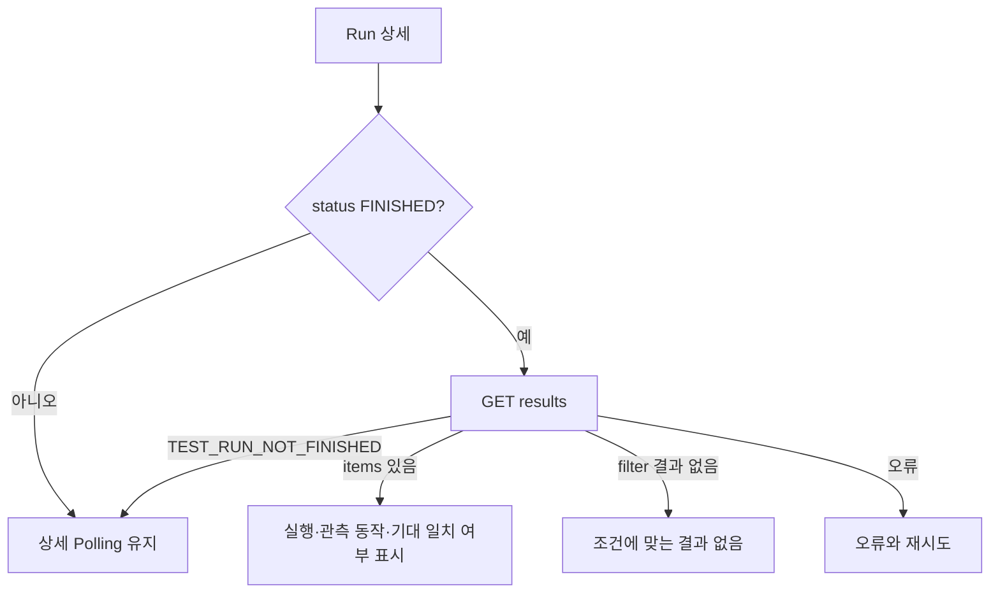
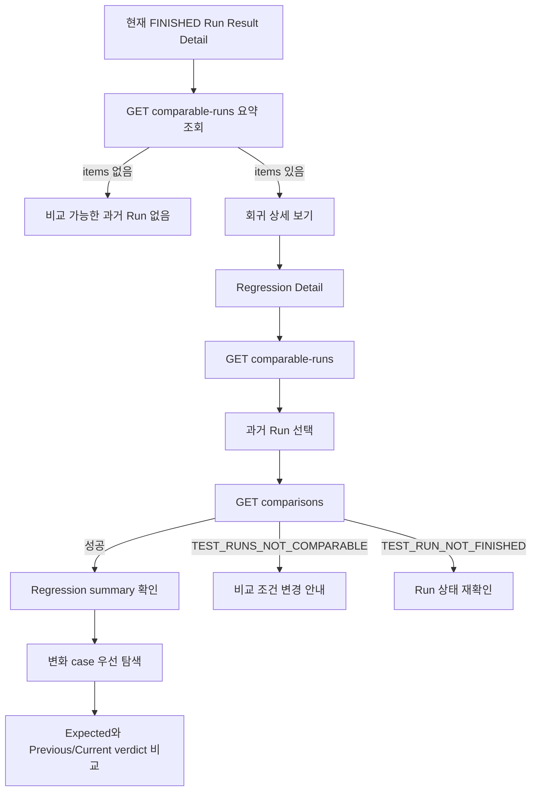

# 프론트엔드 사용자 흐름

> Status: APPROVED
> Owner: Frontend
> Last reviewed: 2026-09-25
> Canonical source: GitHub repository (`src/App.tsx`, `src/routing/`, views and hooks)
> Scope: GitHub Issues #33, #62, #72, #86
> Canonical API: [`../api/openapi.yaml`](../api/openapi.yaml) (`APPROVED`)
> Screen specification: [`screen-spec.md`](screen-spec.md)
> API consumption contract: [`../contracts/api-integration.md`](../contracts/api-integration.md)

이 문서는 source에서 확인한 사용자 흐름과 상태 전이를 승인 기준으로 기록한다. 미구현 사용자 흐름은 `DRAFT`로 분리하며, API schema를 복제하지 않고 Backend OpenAPI와 API 연동 계약을 참조한다.

## 1. 읽는 방법

| 표기 | 의미 |
| --- | --- |
| `Current behavior` | 현재 source에서 확인한 사용자 흐름 |
| `DRAFT` | 구현 또는 별도 승인이 필요한 흐름 제안 |
| `Decision needed` | 별도 Issue 또는 ADR에서 결정할 흐름 정책 |

각 단계의 data 출처는 실제 `API` 또는 `local UI state`다. `VITE_DATA_MODE=demo`는 현재 banner만 표시하고 fixture data를 제공하지 않는다. API 실패 또는 실제 빈 결과를 mock 성공으로 바꾸지 않는다.

## 2. 전체 사용자 여정

필수 핵심 흐름은 하나의 Application Target을 실행하고 관측된 동작과 assertion을 확인하는 것이다. Regression은 현재 Run의 Quality Gate 입력이 아니며, 사용자가 필요할 때 과거 comparable Run과 별도로 비교한다. 이 비교 기능 자체와 comparison API 소비는 MVP 필수다.

현재 구현은 Suite/TestCase 관리, 단일 Application Target으로 Run 생성, Polling, 결과와 Evaluator metrics 검토, comparable Run 조회와 저장 결과 비교를 API에 연결한다. Result Detail에는 `RegressionSummaryEntry`가 있고, 상세 비교는 `RegressionDetailView`에서 수행한다. (`Current behavior`)

## 3. TestSuite와 TestCase 준비

### 사용자 목표

실행할 TestSuite를 선택할 수 있고, 해당 Suite에 최소 한 개의 활성 TestCase가 있도록 준비한다.

### 3.1 Suite 목록 확인

- API 성공의 빈 `items`는 등록된 Suite가 없는 상태다.
- 이전 data를 보여주며 갱신이 실패하면 stale임을 함께 표시한다.
- API에 없는 pass rate, status와 last run을 서버 값처럼 만들지 않는다.

### 3.2 Suite 생성·수정

| action | 정상 종료 | 오류 분기 |
| --- | --- | --- |
| 생성 | POST 성공 data를 목록에 반영하거나 재조회 | validation field, network/API 오류를 form에 유지 |
| 상세 | GET 성공 data 표시 | 미존재와 일시 오류 구분 |
| 수정 | PATCH 성공 후 변경된 field 반영 | validation 실패 시 원래 server state를 성공으로 덮지 않음 |

Suite 삭제 endpoint는 OpenAPI에 없으므로 목표 사용자 흐름에 포함하지 않는다.

Suite 생성은 다음 두 정상 흐름을 지원한다.

1. `testCases`를 생략하거나 `null`, 빈 배열로 보내 빈 Suite를 먼저 생성한다.
2. 초기 TestCase를 함께 보내 Suite와 원자적으로 생성한다. 초기 TestCase 하나라도 validation에 실패하면 부분 생성 없이 전체 요청이 실패한다.

현재 MVP 화면에서는 Suite 이름만으로 생성할 수 있고, 선택한 초기 TestCase는 단건 입력 또는 JSON 배열 직접 입력·UTF-8 JSON 파일·UTF-8 CSV 파일 업로드로 최대 1,000건까지 같은 요청에 포함한다. JSON 파일은 선택 즉시 기존 JSON parser로 검증하고 편집 가능한 입력과 미리보기에 반영한다. 생성 후 TestCase 추가·수정은 공통 TestCase 관리 흐름을 사용한다.

### 3.3 TestCase 조회·변경

1. Suite를 선택하면 TestCase 목록을 조회한다.
2. 존재하는 Suite가 `200`과 빈 `items`를 반환한 상태, `404 TEST_SUITE_NOT_FOUND`, 그 밖의 조회 오류를 구분한다.
3. 생성·수정 validation detail을 관련 field에 표시한다.
4. 삭제는 `204 No Content`가 확인된 뒤 현재 목록에서 제거하거나 재조회한다.
5. 삭제 실패 시 성공 toast를 표시하거나 항목 제거를 확정하지 않는다.
6. 현재 TestCase 변경과 무관하게 과거 Run의 TestCaseSnapshot 결과는 유지된다.

### 실행 가능 조건

활성 TestCase가 없는 Suite로 Run을 만들면 서버는 `TEST_SUITE_EMPTY`로 접수를 거부한다. 프론트는 이 응답을 network 실패와 구분하고 TestCase 준비 흐름으로 돌아갈 수 있게 한다.

## 4. TestRun 생성

### 사용자 목표

TestSuite와 테스트할 Application을 선택하고 실행 요청을 중복 없이 접수한다.

### 4.1 입력 흐름

사용자 언어는 다음 의미를 유지한다.

- **Application**: 테스트할 AI 애플리케이션
- **Application URL**: GuardBench가 호출할 OpenAI-compatible Chat Completions full endpoint
- **Model**: Application request body에 전달할 필수 모델 식별자
- **Revision**: 사용자가 배포·모델·commit을 구분하기 위한 선택 정보
- **Quality Gate 기준**: 이번 Run의 기대 일치율과 실행 성공률에 적용할 최소 통과 비율. 둘 다 비우면 서버 기본 기준 사용

TestCase의 기대 동작과 Backend가 관측한 동작을 비교하며, 사용자는 판정 모델이나 prompt를 설정하지 않는다.

사용자가 Evaluator provider/type, Guardrail identifier/version이나 Snapshot ID를 직접 입력하지 않는다.

### 4.2 현재 흐름 (`Current behavior`)

현재 화면은 Suite 목록을 API로 조회하고 `testSuiteId`, URL/model/revision을 가진 단일 `target`, 선택적인 `qualityGatePolicy`를 최신 `TestRunCreateReq`로 전송한다. 사용자가 입력한 퍼센트는 0~1 비율로 변환하며 두 기준을 모두 비우면 정책을 생략한다. 접수 성공 시 Run 상세로 이동하며 결과 불명 network 오류에서는 동일 payload와 Idempotency-Key를 유지한다.

### 4.3 접수와 멱등성 (`Current behavior`)

1. 한 논리적 제출 시도에 하나의 Idempotency-Key를 연결한다.
2. 사용자가 제출하면 같은 key와 request body로 한 번 접수한다.
3. `202 Accepted`를 받으면 실행 완료가 아니라 안전한 접수 성공으로 표시한다.
4. 현재는 response의 Run ID로 상세 조회에 이동한다. Location header 보존은 남은 계약 격차다.
5. 응답을 받지 못해 결과가 불명확한 경우 동일 body 재전송에 같은 key를 사용한다.
6. 다른 body에 같은 key를 재사용하지 않는다.

현재 key는 payload fingerprint별로 메모리에 보존하며 network 결과 불명에서 재사용하고 성공 또는 명시적 서버 거부 후 폐기한다. 화면 이탈 후 복원과 장기 보존은 구현되어 있지 않다.

### 4.4 생성 오류 분기

| 상황 | 의미 | 다음 행동 |
| --- | --- | --- |
| validation | Suite, URL, model, revision 또는 Quality Gate 기준 오류 | 관련 control에 detail 표시 |
| `TEST_SUITE_NOT_FOUND` | 선택 Suite가 더 이상 존재하지 않음 | Suite 목록 재조회 |
| `TEST_SUITE_EMPTY` | 활성 TestCase가 없음 | TestCase 준비로 이동 |
| `IDEMPOTENCY_KEY_CONFLICT` | 같은 key를 다른 body에 재사용 | 자동 재시도 중단, 새 논리 시도 안내 |
| network/timeout | 접수 여부가 불명확할 수 있음 | 같은 key 재사용 정책에 따라 확인·재시도 |

취소 전송의 보장, timeout 값과 자동 retry는 OpenAPI만으로 정하지 않는다.

## 5. Run 진행 확인

### 사용자 목표

접수된 Run이 어느 단계인지 확인하고 완료 또는 오류 종료까지 상태를 잃지 않는다.

### 상태 축

| 축 | 값 | 흐름에서의 역할 |
| --- | --- | --- |
| lifecycle `status` | QUEUED, PREPARING, RUNNING, FINISHED | Polling 지속·종료 |
| `executionOutcome` | COMPLETED, ERROR, INCOMPLETE, null | 처리 종료 결과 |
| Quality Gate | PASS, FAIL, NOT_EVALUATED, null | 현재 Run assertion 집계 판정 |

`FINISHED`는 성공만을 의미하지 않는다. ERROR 또는 INCOMPLETE로 종료될 수 있으며 Gate FAIL도 HTTP 조회 실패가 아니다.

### 현재 Polling 흐름 (`Current behavior`)

1. 생성 또는 Run 선택 직후 상세를 한 번 조회한다.
2. 진행 상태이면 processed count, percent와 updatedAt을 표시한다.
3. 같은 Run의 다음 조회를 예약한다.
4. Run 변경 또는 화면 이탈 시 이전 timer/request를 취소한다.
5. 늦게 도착한 이전 응답을 현재 Run에 적용하지 않는다.
6. FINISHED에서 Polling을 중단한다.

현재 polling은 기본 3초 간격이며 hidden tab에서는 최소 10초로 늦춘다. `INVALID_RESPONSE`와 408/429를 제외한 4xx는 retry하지 않고 멈춘다. 다른 transient 오류는 연속 5회까지 시도하며 다섯 번째 실패에서 멈춘다. 중단 후 사용자는 상세 화면의 재시도 action으로 polling을 다시 시작할 수 있다. 최대 전체 대기 시간은 설정하지 않았다.

## 6. 현재 Run 결과 검토

### 사용자 목표

Run의 처리 신뢰도와 Quality Gate를 확인하고 TestCaseSnapshot별 Evaluator 판정을 검토한다. Regression은 현재 Run 해석과 섞지 않고 Result Detail의 요약/진입점에서 별도 분석 화면으로 이동한다.

### 6.1 상세 요약

FINISHED 전후에 다음 정보를 표시한다.

- TestSuite ID와 Run ID
- Application Target URL, required model과 optional revision
- lifecycle와 progress
- execution outcome
- Quality Gate status
- 실행 관련 시각

`qualityGate: null`은 결정 전이며 `NOT_EVALUATED + metrics: null`은 종료됐지만 평가 가능한 Assertion이 없는 상태다. PASS/FAIL에서는 서버의 `assertion`과 `execution`에 담긴 현재값·기준·통과 여부를 표시한다. FAIL이면 `passed: false`인 항목의 이유를 설명하고 Gate나 metric 판정을 프론트에서 재계산하지 않는다.

### 6.2 개별 결과 조회

각 결과에서 다음을 구분한다.

- 테스트 케이스 Snapshot의 입력과 기대 동작
- 대상 애플리케이션과 판정 처리의 실행 상태
- 관측된 동작
- 기대 동작과 관측된 동작의 기대 일치 여부
- `정상 차단 (TP) / 정상 허용 (TN) / 과차단 (FP) / 차단 누락 (FN)` 판정 유형
- 대상 애플리케이션 또는 판정 처리의 실패 단계와 안전한 오류

결과 목록에는 Application Response가 포함되지 않는다. 사용자가 Snapshot 상세 dialog를 열면 전용 결과 상세 API를 호출해 `applicationResponse`를 가져온다. 값이 `null`이면 저장된 응답이 없다고 표시하고, 문자열이 있으면 기본 접힘 상태에서 사용자가 `응답 내용 보기`를 선택해 원문을 펼치거나 다시 숨길 수 있다.

### 6.3 결과 해석

| 기대 동작 | 관측된 동작 | 판정 유형 | 기대 일치 여부 |
| --- | --- | --- | --- |
| BLOCK | BLOCK | 정상 차단 (TP) | 일치 (PASS) |
| BLOCK | ALLOW | 차단 누락 (FN) | 불일치 (FAIL) |
| ALLOW | BLOCK | 과차단 (FP) | 불일치 (FAIL) |
| ALLOW | ALLOW | 정상 허용 (TN) | 일치 (PASS) |

관측된 동작이 없으면 기대 일치 여부와 판정 유형도 `null`일 수 있다. 실행 실패를 `과차단 (FP)`/`차단 누락 (FN)` 또는 기대 불일치(FAIL)로 추정하지 않는다.

### 6.4 결과 filter와 빈 상태

filter는 저장된 Run 결과를 다시 실행하거나 재평가하지 않고, 조건에 맞는 결과 item만 server-side로 조회한다.

- name과 input: 부분 일치 검색
- category, expected action과 severity: TestCaseSnapshot 속성으로 제한
- execution status: 실패, timeout, 미시작 등 실행 처리 상태로 제한
- 기대 일치 여부: PASS 또는 FAIL로 제한
- 판정 유형: `정상 차단 (TP)`, `정상 허용 (TN)`, `과차단 (FP)` 또는 `차단 누락 (FN)`으로 제한

예를 들어 `evaluationOutcome=FALSE_NEGATIVE`는 기대 동작이 BLOCK이지만 관측된 동작이 ALLOW인 저장 결과만 조회하며 화면에는 `차단 누락 (FN)`으로 표시한다. filter 결과가 비어 있으면 “현재 조건과 일치하는 결과 없음”으로 표시하며 Run 전체 결과 없음과 구분한다.

filter가 적용된 현재 page로 전체 TP/TN/FP/FN metrics나 Quality Gate를 다시 계산하지 않는다. 전체 집계는 evaluator-metrics와 Run 상세 응답을 source of truth로 사용한다.

### 6.5 현재 구현 (`Current behavior`)

현재 결과 화면은 단일 Application 실행, 관측된 동작, 기대 일치 여부, 판정 유형과 안전한 오류를 표시한다. 결과 filter/page, evaluator-metrics와 Quality Gate는 각 서버 응답을 독립적으로 사용한다.

`RegressionSummaryEntry`는 `GET /api/v1/test-runs/{testRunId}/comparable-runs`로 baseline을 고르고 case-level `items`가 없는 comparison summary endpoint에서 변화 집계를 조회한다. 비교 가능한 Run이 있으면 `회귀 상세 보기` action을 제공하며, 전체 comparison payload와 table은 Regression Detail 진입 전에는 불러오거나 표시하지 않는다.

## 7. 판정 분석

### 사용자 목표 (`Current behavior`)

관측된 동작이 테스트 케이스의 기대 동작과 어떻게 일치했는지 집계 관점에서 검토한다.

1. FINISHED Run에서 evaluator-metrics endpoint를 조회한다.
2. 서버가 반환한 TP/TN/FP/FN count를 `정상 차단 / 정상 허용 / 과차단 / 차단 누락`으로 표시하고 기술 코드는 보조 표기로 둔다.
3. 분모가 없는 경우 `null`일 수 있는 FP/FN rate를 0으로 바꾸지 않는다.
4. 과차단/차단 누락 항목을 보고 싶으면 결과 endpoint의 evaluation outcome filter를 사용한다.
5. result page 일부에서 전체 metrics를 다시 계산하지 않는다.

이 분석은 현재 테스트 케이스의 기대 동작을 기준으로 한 결과이지 모델의 보편적 정확도나 절대 ground truth가 아니다. 관측된 동작이 없는 실행 실패는 metrics에서 제외한다. 현재 Result Detail 안에서 제공한다.

## 8. 과거 Run과 Regression 비교

### 사용자 목표 (`Current behavior`)

Result Detail에서 Regression의 존재를 빠르게 인지한 뒤, 별도 Regression Detail 화면으로 이동해 현재 Run과 backend가 comparable로 판정한 과거 FINISHED Run의 저장 결과를 비교한다.

### Result Detail 책임

- 현재 Run 자체의 실행 결과와 Quality Gate를 우선한다.
- Regression은 `RegressionSummaryEntry`로 요약/진입점만 제공한다.
- comparable Run이 존재하는지 확인한다.
- 전체 comparison table이나 case-level 변화 분석은 렌더링하지 않는다.

### Regression Detail 책임

- 프론트는 같은 Suite라는 이유로 후보를 추가하지 않는다.
- Application target URL/model/revision은 비교 축이므로 후보마다 달라도 될 수 있다.
- Application Target과 완료 시각은 사용자 맥락으로 표시하지만 실제 comparability 판정은 backend가 소유한다.
- 비교 중 Application이나 Evaluator를 다시 호출하지 않는다.
- Quality Gate와 Regression을 하나의 PASS/FAIL로 합치지 않는다.
- summary의 changed/unchanged/regressed/improved/notComparable 값을 서버 값 그대로 사용한다.
- case-level `changeType`과 `comparabilityStatus`를 재계산하지 않는다.
- changed-only filter를 사용해 변화 case를 먼저 볼 수 있다. 향후 tab/filter 표현이 바뀌어도 Regression/Improvement/변화 우선 탐색이라는 목적은 유지한다.
- 한 case에서 Expected, Previous verdict, Current verdict, comparability와 change type을 같은 상세 맥락에서 확인한다.
- 현재 데이터만으로 가능한 경우 `ALLOW → BLOCK`, `BLOCK → ALLOW` 같은 action transition을 보조 표현으로 사용할 수 있으나 이를 위해 신규 backend API를 요구하지 않는다.

comparison response는 `SECURITY_REGRESSION`, `USABILITY_REGRESSION`, `IMPROVEMENT`, `POLICY_BEHAVIOR_CHANGED`, `NO_CHANGE`를 확정해서 반환한다. 프론트는 서버 값을 그대로 사용한다.

Regression Detail은 Result Detail의 drill-down 화면이다. 현재 앱은 local view state를 사용하므로 `regression` view로 전환하며, 이 작업을 위해 새 routing library를 도입하지 않는다.

## 9. 공통 예외와 복구

| 상황 | 사용자에게 보여줄 상태 | 금지되는 처리 |
| --- | --- | --- |
| API 성공 + empty | 실제 빈 결과와 관련 CTA | mock 성공 data 대체 |
| validation | field별 오류와 입력 유지 | 일반 실패 toast만 표시 |
| 404 | 리소스 미존재와 돌아갈 경로 | stale data를 최신으로 표시 |
| 409 not finished | 진행 상태 재확인 | 결과 없음으로 확정 |
| 409 not comparable | 비교 불가와 후보 재선택 | 프론트에서 비교 강행 |
| network/timeout | 결과 불명·재시도 가능성 | 명시적 서버 거부로 단정 |
| request abort | 조용한 취소와 이전 응답 폐기 | 실패 toast |
| refresh error | 이전 data + stale 표시 | 이전 data를 최신으로 표시 |

## 10. 화면과 API 추적표

| 사용자 목표 | 화면/source owner | 현재 구현 |
| --- | --- | --- |
| Suite 조회·생성 | `SuitesView`, `CreateSuiteModal` | API 조회·생성, loading/empty/error 구분 |
| Suite 및 TestCase 관리 | `SuiteDetailModal`, `BulkTestCaseCreatePanel` | 단건 생성/수정/삭제, paginated 조회, bulk JSON/CSV 등록 |
| TestRun 생성 | `NewRunView`, `testRunService` | 단일 Application Target과 선택 Quality Gate 기준으로 접수 |
| Run 이력 | `RunsView` | 목록 조회, ID/Suite ID 검색, lifecycle filter |
| Run 결과·Gate | `ResultDetailView`, `useLiveRunProgress` | 상세 polling, paginated/filter 결과, 서버 Quality Gate evidence |
| Regression 비교 | `App`, `useRegressionComparison`, Regression views | comparable Run 선택과 summary/detail comparison 조회 |

Endpoint, method, request/response shape는 [API 연동 계약](../contracts/api-integration.md)과 Backend OpenAPI에서 관리하며 이 표에서는 반복하지 않는다.

## 11. Decision backlog

- Run 생성 후 기본 이동 화면과 navigation 복원
- Idempotency-Key 생성·저장·폐기 정책
- Polling interval, retry, backoff와 background 동작
- pagination/filter의 URL 보존
- error code별 최종 사용자 문구
- Evaluator 분석의 tab/별도 화면 배치
- Regression Detail의 세부 시각적 표현과 action transition 표시 방식
- report/export 범위

위 backlog 항목은 현재 구현 계약이 아니며, 채택하려면 별도 Issue에서 범위와 요구사항을 승인한다. Application Response의 현재 API와 UI 동작은 앞서 설명한 구현 흐름을 따른다.

## 12. 검증 근거

- [`../api/openapi.yaml`](../api/openapi.yaml)
- [`screen-spec.md`](screen-spec.md)
- [`../contracts/api-integration.md`](../contracts/api-integration.md)
- `src/App.tsx`
- `src/components/views/ResultDetailView.tsx`
- `src/components/views/RegressionSummaryEntry.tsx`
- `src/components/views/RegressionDetailView.tsx`
- `src/components/views/RegressionComparisonSection.tsx`
- `src/components/common/`
- `src/services/regressionService.ts`
- `src/services/`
- `src/hooks/useLiveRunProgress.ts`
- GitHub Issues #19, #27, #28, #29, #30, #33, #72
- GitHub PR #71, #88

이 문서는 OpenAPI 계약을 변경하지 않는다.
